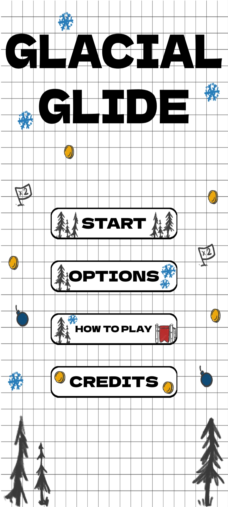
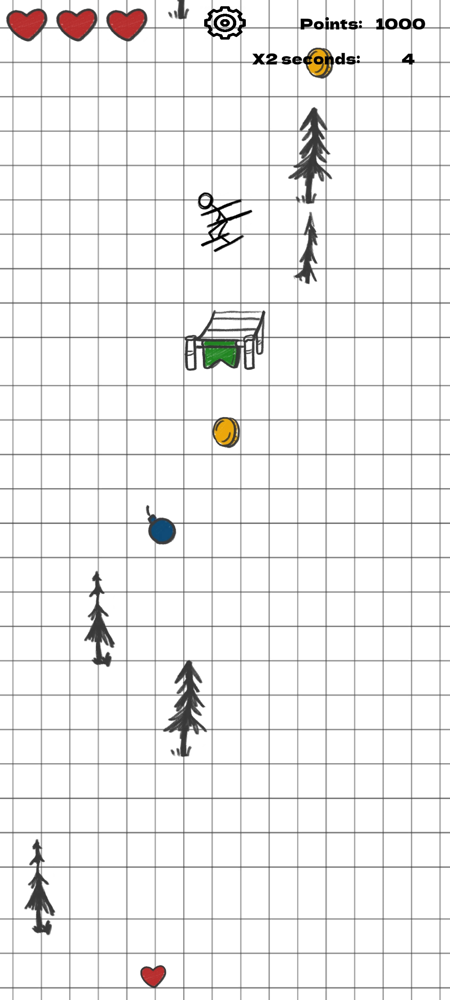

# Glacial-Glide
Repository for final exam of Mobile course at University of Verona for the Master in Computer Game Development.

Developers:

Paolo Castagnetti, Mattero Guardini, Stefano Gallo

## Introduction
Glacial Glide is a mobile casual game where the player’s goal is to score as many points as they can.

They take control of a skier going downhill avoiding trees and collecting coins. There are also ramps of different sizes that allow for acrobatic jumps that can give extra points if completed correctly.

Falling from a jump or hitting a tree consumes a life. When the player runs out of lives it’s game over.

## Main menu screenshot

## Game scene screenshot
